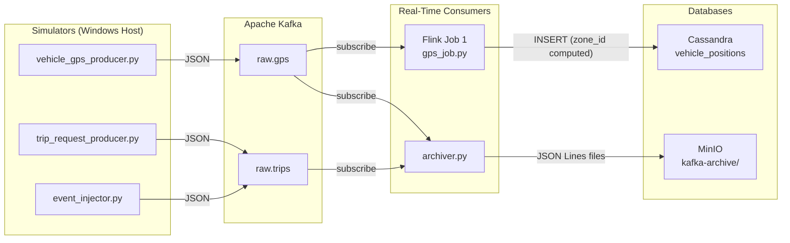

# TaaSim — Complete Project Guide (Weeks 1–3)
## Transport-as-a-Service Simulator for Casablanca

---

## Table of Contents
1. [Why Each Tool?](#1-why-each-tool)
2. [Project Structure](#2-project-structure)
3. [Data Flow Diagram](#3-data-flow-diagram)
4. [Week 1 — Data Exploration & Simulators](#4-week-1)
5. [Week 2 — Storage Design](#5-week-2)
6. [Week 3 — Flink Stream Processing](#6-week-3)
7. [Code Walkthrough (Every File)](#7-code-walkthrough)
8. [How to Run & Test](#8-how-to-run--test)

---

## 1. Why Each Tool?

### Apache Kafka — The Mailbox System
**What:** A distributed message broker (pub/sub).
**Why we need it:** When 1,000 taxis send GPS pings simultaneously, we can't write them all directly to a database — it would crash. Kafka acts as a **buffer**. Producers (simulators) write to Kafka topics; consumers (Flink, Archiver) read at their own pace.
**In our project:** 5 topics — `raw.gps`, `raw.trips`, `processed.gps`, `processed.demand`, `processed.matches`.

### Apache Flink — The Real-Time Brain
**What:** A distributed stream-processing engine.
**Why we need it:** Kafka stores raw data, but raw GPS coordinates are useless without math. Flink sits between Kafka and Cassandra, performing transformations **in real-time** (milliseconds) as data flows. Unlike Spark which processes data in batches (every hour), Flink processes each message the instant it arrives.
**In our project:** Flink Job 1 reads `raw.gps`, computes `zone_id`, writes to Cassandra.

### Apache Cassandra — The Speed Database
**What:** A distributed NoSQL database optimized for writes.
**Why we need it:** We need to answer queries like "How many taxis are in Zone 7 right now?" in under 10ms. Cassandra's partition key `(city, zone_id)` puts all Zone 7 data on one physical node = O(1) lookup. Traditional SQL databases (PostgreSQL) would need a full table scan.
**In our project:** 3 tables — `vehicle_positions`, `trips`, `demand_zones`. Data auto-deletes via TTL (24h for positions, 7 days for demand).

### MinIO — The Data Lake (Cold Storage)
**What:** S3-compatible object storage.
**Why we need it:** Cassandra deletes old data (TTL). But for Machine Learning, we need **years** of historical data. MinIO permanently stores every raw Kafka message as JSON files. It's also where Spark reads/writes Parquet files.
**In our project:** 4 buckets — `raw/` (source CSVs), `curated/` (Spark output), `ml-store/` (ML models), `kafka-archive/` (raw Kafka backup).

### Apache Spark — The Batch Brain
**What:** A distributed batch-processing engine.
**Why we need it:** Flink handles real-time (seconds). Spark handles historical analysis (hours/days). Spark reads the entire Porto dataset (1.7M trips), applies geospatial transformations, and writes curated Parquet files. Later, Spark ML will train demand prediction models on historical data.
**In our project:** `porto_to_casablanca.py` remaps Porto GPS → Casablanca coordinates.

### Grafana — The Dashboard
**What:** Visualization and monitoring platform.
**Why we need it:** All the data in Cassandra is useless if nobody can see it. Grafana connects directly to Cassandra and renders live dashboards showing taxi positions, demand heatmaps, and trip metrics.

---

## 2. Project Structure

```
BigDataPr/
├── docker-compose.yml          # 12 services (Kafka, MinIO, Cassandra, Flink, Spark, Jupyter, Grafana...)
├── data/
│   ├── train.csv               # Porto taxi dataset (1.9 GB, 1.7M trips)
│   ├── yellow_tripdata_*.parquet  # NYC TLC demand data
│   └── zone_mapping.csv        # Zone ID → Arrondissement name
├── src/
│   ├── simulators/
│   │   ├── vehicle_gps_producer.py   # Simulates 1,000 taxis → Kafka raw.gps
│   │   ├── trip_request_producer.py  # Simulates passenger ride requests → Kafka raw.trips
│   │   └── event_injector.py         # Injects demand spikes (stadium exit scenario)
│   ├── flink/
│   │   ├── Dockerfile                # Custom Flink image with Python 3.10 + PyFlink
│   │   └── gps_job.py               # ★ Flink Job 1: GPS → zone_id → Cassandra
│   ├── archiver/
│   │   ├── Dockerfile                # Lightweight Python 3.11 image
│   │   └── archiver.py              # Kafka → MinIO cold storage backup
│   ├── spark/
│   │   └── porto_to_casablanca.py   # Spark ETL: Porto CSV → Casablanca Parquet
│   └── cassandra_schema.cql         # CREATE KEYSPACE + 3 tables
├── notebooks/
│   └── week1_exploration.ipynb       # Data profiling (trip durations, demand curves, maps)
├── scripts/
│   └── upload_raw_to_minio.ps1       # PowerShell: upload local CSVs to MinIO
└── docs/
    └── COMPLETE_PROJECT_GUIDE.md     # ← You are here
```

---

## 3. Data Flow Diagram



**Key insight:** Kafka uses **Pub/Sub**. Both Flink and the Archiver read the same `raw.gps` topic independently. Flink does math; the Archiver blindly stores everything. They don't interfere with each other.

---

## 4. Week 1 — Data Exploration & Simulators

### What was done
- Set up `docker-compose.yml` with all 12 services
- Explored Porto dataset in Jupyter (`week1_exploration.ipynb`): trip duration distribution, call type breakdown, temporal demand curve
- Built `vehicle_gps_producer.py`: reads Porto `train.csv`, remaps coordinates to Casablanca bounding box, adds Gaussian noise, clamps to land polygon, sends to Kafka `raw.gps`
- Built `trip_request_producer.py`: generates random ride requests with demand multipliers (rush hour = 3–5×)
- Built `event_injector.py`: simulates demand spikes (e.g., stadium exit)

### Key code logic: `vehicle_gps_producer.py`
1. **Load**: Reads 50,000 rows from Porto `train.csv`
2. **Parse**: Each row has a `POLYLINE` field = JSON array of `[lon, lat]` points recorded every 15 seconds
3. **Transform** (`transform_coordinate`): Normalizes Porto coords to [0,1], scales to Casablanca bounding box, adds ±20m noise
4. **Land Clamp** (`coerce_to_land_point`): Uses ray-casting polygon test to ensure coordinates stay on land (not ocean)
5. **Emit**: Sends JSON `{taxi_id, timestamp, lat, lon, speed, status}` to Kafka every 1.5s (at 10× speed)

---

## 5. Week 2 — Storage Design

### What was done
- Designed Cassandra schema (`cassandra_schema.cql`) with 3 tables
- Built custom `archiver.py` to replace heavy Confluent Kafka Connect
- Wrote Architecture Decision Record (`ADR_01_Storage_Design.md`)
- Created MinIO bucket structure

### Cassandra Schema Explained

| Table | Partition Key | Why | TTL |
|-------|--------------|-----|-----|
| `vehicle_positions` | `(city, zone_id)` | Query: "All taxis in Zone 7" = single-partition read | 24 hours |
| `trips` | `(city, date_bucket)` | Query: "All trips today" = bounded partition size | None |
| `demand_zones` | `(city, zone_id)` | Query: "Current demand in Zone 7" = single-partition read | 7 days |

**Why partition keys matter:** Cassandra distributes data across nodes using the partition key hash. If you query by partition key, it goes to ONE node (fast). If you don't, it scans ALL nodes (disaster).

### MinIO Bucket Structure

| Bucket | Purpose | Written By |
|--------|---------|-----------|
| `raw/` | Source datasets (train.csv, NYC parquet) | `upload_raw_to_minio.ps1` |
| `curated/` | Transformed Parquet files | Spark `porto_to_casablanca.py` |
| `kafka-archive/` | Raw Kafka message backup (JSON Lines) | `archiver.py` |
| `ml-store/` | Trained ML models | Spark ML (Week 5) |

### Archiver Logic (`archiver.py`)
1. Subscribes to `raw.gps` and `raw.trips` as a Kafka consumer group
2. Batches 100 messages (or 30 seconds, whichever first)
3. Writes each batch as a JSON Lines file to MinIO: `kafka-archive/raw.gps/2026/04/20/14/batch_001.json`
4. Runs 24/7 inside Docker (`restart: unless-stopped`)

---

## 6. Week 3 — Flink Stream Processing (GPS Normalizer)

### What was done
- Created custom Flink Dockerfile with Python 3.10 + PyFlink + Kafka/Cassandra JARs
- Updated `docker-compose.yml` to `build: ./src/flink`
- Wrote `gps_job.py` with: watermarks, checkpointing, grid quantization, Cassandra sink

### What `gps_job.py` does (step by step)

```
Kafka raw.gps  →  Deserialize JSON  →  Extract Timestamp (watermark)
               →  Validate Bounds   →  Compute zone_id (4×4 grid)
               →  INSERT INTO Cassandra vehicle_positions
```

#### Feature 1: Watermarks (3-minute lateness tolerance)
```python
class GPSTimestampAssigner(TimestampAssigner):
    def extract_timestamp(self, value, record_timestamp):
        data = json.loads(value)
        return int(data.get('timestamp', record_timestamp))
```
**Why:** GPS pings from taxis can arrive late (network delay, tunnel, etc.). The watermark tells Flink: "Use the `timestamp` field inside the JSON as the event time, not the time it arrived at Kafka." This ensures correct ordering even if messages arrive out of order.

#### Feature 2: Checkpointing (every 60 seconds)
```python
env.enable_checkpointing(60_000, CheckpointingMode.EXACTLY_ONCE)
```
**Why:** If Flink crashes, it needs to know where it left off. Every 60 seconds, Flink saves its current Kafka offset + internal state to disk. On restart, it resumes from the last checkpoint instead of re-reading all data from the beginning. `EXACTLY_ONCE` guarantees no duplicate inserts into Cassandra.

#### Feature 3: Grid Quantization (Lat/Lon → Zone ID)
```python
grid_x = int(4 * (lon - CASA_LON_MIN) / (CASA_LON_MAX - CASA_LON_MIN))
grid_y = int(4 * (lat - CASA_LAT_MIN) / (CASA_LAT_MAX - CASA_LAT_MIN))
zone_id = (grid_y * 4) + grid_x + 1
```
**The math:** We overlay a 4×4 grid on Casablanca (Lon: -7.80 to -7.40, Lat: 33.40 to 33.70). Each cell is ~10km × ~8.3km. A taxi at `(-7.55, 33.62)` maps to `grid_x=2, grid_y=2` → `zone_id = 2*4 + 2 + 1 = 11`.

#### Feature 4: Cassandra Sink (Prepared Statements)
```python
self.prepared_stmt = self.session.prepare("INSERT INTO vehicle_positions ...")
self.session.execute(self.prepared_stmt, [values...])
```
**Why prepared statements?** Cassandra pre-compiles the CQL query once. For every subsequent INSERT, only the raw parameter bytes are sent over the network — no parsing overhead. This is critical when processing thousands of messages per second.

---

## 7. Code Walkthrough (Every File)

### `docker-compose.yml` — 12 Services

| # | Service | Image | Port | Role |
|---|---------|-------|------|------|
| 1 | `kafka` | apache/kafka:3.7.0 | 9092 | Message broker (KRaft, no Zookeeper) |
| 1b | `kafka-init` | same | — | Creates 5 topics, then exits |
| 2 | `minio` | minio/minio | 9000, 9001 | S3-compatible object storage |
| 2b | `minio-init` | minio/mc | — | Creates 4 buckets, then exits |
| 3 | `cassandra` | cassandra:4.1 | 9042 | NoSQL speed database |
| 3b | `cassandra-init` | same | — | Applies `cassandra_schema.cql`, then exits |
| 4a | `flink-jobmanager` | custom (Dockerfile) | 8081 | Flink coordinator (Boss) |
| 4b | `flink-taskmanager` | custom (Dockerfile) | — | Flink worker (2 slots) |
| 5a | `spark-master` | apache/spark:3.5.3 | 8080, 7077 | Spark coordinator |
| 5b | `spark-worker` | same | — | Spark executor (2 cores, 2GB) |
| 6 | `jupyter` | pyspark-notebook | 8888 | Notebook IDE (token: `taasim`) |
| 7 | `kafka-archiver` | custom (Dockerfile) | — | Kafka → MinIO backup |
| 8 | `grafana` | grafana/grafana | 3000 | Dashboards (password: `admin`) |

### `src/flink/Dockerfile`
```dockerfile
FROM flink:1.18-java11
# Install Python so Flink can run PyFlink jobs
RUN apt-get install -y python3.10 python3-pip
RUN pip3 install apache-flink==1.18.0 cassandra-driver
# Download Kafka + Cassandra connector JARs
RUN wget -P /opt/flink/lib/ .../flink-sql-connector-kafka-3.0.1-1.18.jar
RUN wget -P /opt/flink/lib/ .../flink-connector-cassandra_2.12-1.16.3.jar
```
**Why custom?** The stock Flink image only has Java. Our jobs are Python.

### `src/simulators/trip_request_producer.py`
Generates fake passenger ride requests. Sends `{trip_id, rider_id, origin_zone, destination_zone, requested_at, call_type}` to `raw.trips`. Demand multiplier: 3–5× during rush hours (7–9 AM, 5–7 PM).

### `src/simulators/event_injector.py`
Manual tool to simulate extreme scenarios. Example: `python event_injector.py --type spike --zone 5 --factor 3 --duration 5` floods Zone 5 with 3× demand for 5 minutes (simulates a stadium exit).

### `src/spark/porto_to_casablanca.py`
Batch ETL job. Reads `s3a://raw/porto/train.csv` from MinIO, applies the same Porto→Casablanca coordinate transformation as the simulator (but on the entire dataset), clips trajectories at coastline, writes curated Parquet to `s3a://curated/porto/`.

### `scripts/upload_raw_to_minio.ps1`
PowerShell script that uploads local `data/train.csv` and `data/yellow_tripdata_*.parquet` files into MinIO's `raw/` bucket using a temporary `minio/mc` Docker container.

---

## 8. How to Run & Test

### Step 0: Prerequisites
- Docker Desktop running on Windows
- Python 3.10+ with: `pip install pandas kafka-python boto3`

### Step 1: Start all services
```bash
cd C:\Users\drqsa\OneDrive\Desktop\Folders\BigDataPr
docker-compose up -d --build
```
Wait ~3 minutes for everything to boot (Cassandra takes the longest).

### Step 2: Verify Cassandra schema was applied
```bash
docker exec -it taasim-cassandra cqlsh -e "DESCRIBE KEYSPACE taasim;"
```
If it says `Keyspace 'taasim' not found`, manually apply:
```bash
docker cp .\src\cassandra_schema.cql taasim-cassandra:/schema.cql
docker exec taasim-cassandra cqlsh -f /schema.cql
```

### Step 3: Upload data to MinIO
```powershell
.\scripts\upload_raw_to_minio.ps1
```
Or verify MinIO is working at: http://localhost:9001 (login: admin/password)

### Step 4: Start the Flink Job
```bash
docker exec -it taasim-flink-jm flink run --python /opt/flink/usrlib/gps_job.py
```
Expected output: `Job has been submitted with JobID ...`

### Step 5: Start the GPS Simulator
In a **new terminal**:
```bash
python .\src\simulators\vehicle_gps_producer.py --csv ./data/train.csv
```

### Step 6: Verify data reached Cassandra
In a **third terminal**:
```bash
docker exec -it taasim-cassandra cqlsh -e "SELECT * FROM taasim.vehicle_positions LIMIT 5;"
```
You should see rows with `city=casablanca`, computed `zone_id` values (1–16), and taxi coordinates.

### Step 7: Check the Flink Dashboard
Open http://localhost:8081 — you should see "GPS Normalizer Job" running with status `RUNNING`.

### Step 8: Check MinIO Archive
Open http://localhost:9001 → `kafka-archive` bucket. You should see JSON files being written by the archiver.

### Troubleshooting

| Error | Cause | Fix |
|-------|-------|-----|
| `NoHostAvailable: keyspace 'taasim'` | Cassandra schema not applied | Run Step 2 manual apply |
| `TimeoutException: partition raw.gps-X` | Kafka still booting | Wait 30s, retry the flink command |
| `ModuleNotFoundError: pandas` | Missing local Python deps | `pip install pandas kafka-python boto3` |
| `NoSuchKey: train.csv` | MinIO bucket empty | Run `upload_raw_to_minio.ps1` or use `--csv ./data/train.csv` |

---

> **What changed in gps_job.py for Week 3 completion:**
> 1. Added `GPSTimestampAssigner` class for event-time watermark extraction
> 2. Added `env.enable_checkpointing(60_000, CheckpointingMode.EXACTLY_ONCE)`
> 3. Replaced `WatermarkStrategy.no_watermarks()` with `WatermarkStrategy.for_monotonous_timestamps().with_timestamp_assigner()`
> 4. Added comprehensive docstrings and inline documentation
